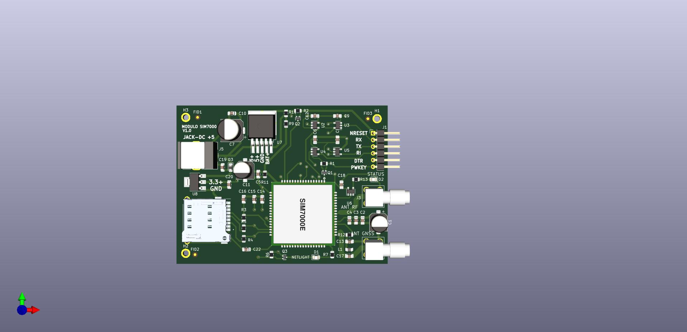

## Trabajo práctico final de la asignatura DCI ##
Este repositorio contiene el trabajo práctico final para la asignatura de Diseño de Circuitos Impresos de la carrera de posgrado de FIUBA.

* Autor: German Gabriel Velardez
* Título corto del trabajo:  Replica de modulo de comunicacion basado en el chip SIM7000G
* Descripción:  Modulo de comunicacion basado GSM/4G con GNSS incluido.

## Licencia de este trabajo ##
La licencia utilizada en este proyecto es : <b>CERN Open Hardware Licence Version 2</b>. 

## Estructura del TP FINAL ##

Se repositorio esta estructurado de la siguiente manera.

* doc: Toda la información sobre el circuito, principalmente de autoría o procesamiento propio. 
* info: Toda la iformación recolectada sobre el circuito, como por ejemplo:
  * Hojas de datos.
  * Info de productos comerciales.
  * Info en internet.
* pcb: Archivos de diseño esquemático y pcb.

## Replica de modulo de comunicacion basado en SIM7000
# Diseño final

 ### Dimensiones del nuevo modulo:
  <ul>
    <li>
     Largo: 80 mm
    </li>  
    <li>
    Ancho: 60 mm
    </li> 
  </lu> 

  ### Primera tentativa de posicionamiento de elementos
  

  

