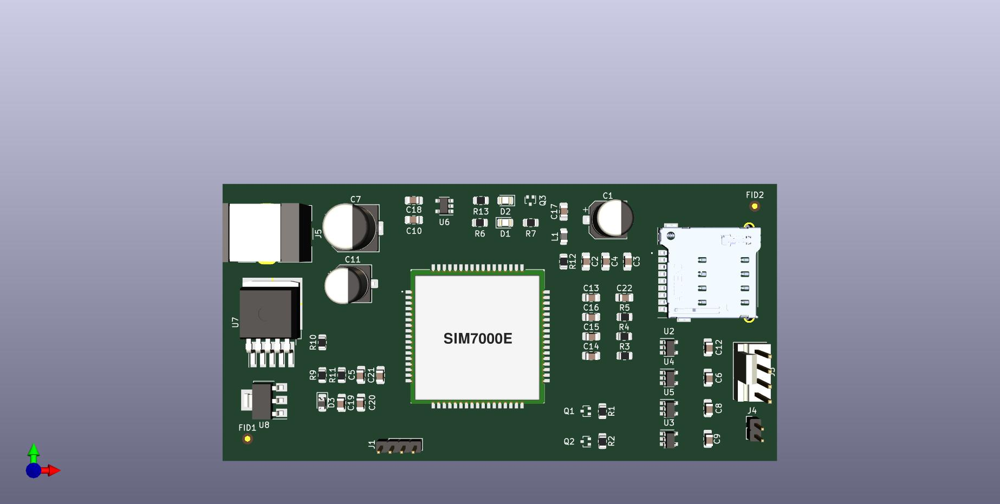

## Propuesta ##
En este directorio debe ir OBLIGATORIAMENTE la información que se presentó al momento de acordar la propuesta de TP con el docente. Es decir:
* Fotos e imágenes de las placas de ambos lados si es una réplica. 
* Fotos e imágenes de los prototipos cableados o pruebas si es un trabajo de tesis.
* Urls o info de origen. 
* Circuito esquemático de referencia (si es una réplica) o borrador si es un trabajo de tesis.
* Resumen de la función u objetivo del circuito si es un trabajo de tesis.
* Cualquier otra nota que se haya usado para definir el TP en el formulario de propuesta.

## Propuesta ##

## Replica de modulo de comunicacion basado en SIM7000

El objetivo del proyecto es utilizando como base el esquematico del producto de <b>Shield Celular para EESA-IOT<b> diseñar un modulo con dimesiones mas favorables para el uso esquecifico que tendra el modulo. Para ello de eliminaran algunos elementos que no se usaran.
 ### Dimensiones del nuevo modulo:
  <ul>
    <li>
     Largo: 100 mm
    </li>  
    <li>
    Ancho: 50 mm
    </li> 
  </lu> 

  ### Primera tentativa de posicionamiento de elementos
  

  

 
